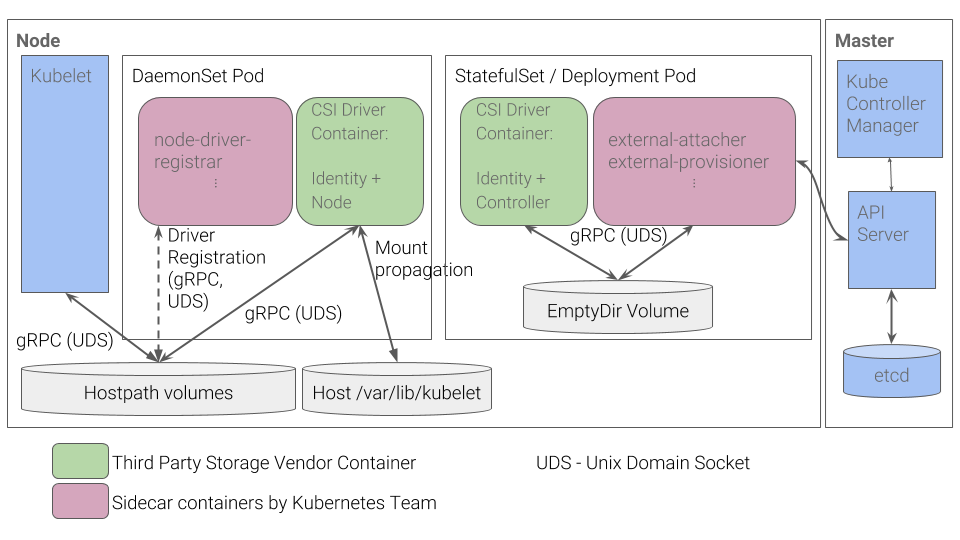

# AKS Public cluster &amp; storage 101

# Introduction
This is an introduction to play with Storage integration in AKS : Azure Disk + File + Blob, Secret Store, etc.

## **Disclaimer**

**The features described in this workshop might be not yet production-ready, we enable preview-features for the purpose of learning.**

See also :

- [Storage options for applications in AKS](https://docs.microsoft.com/en-us/azure/aks/concepts-storage)
- [Best practices for storage and backups in AKS](https://docs.microsoft.com/en-us/azure/aks/operator-best-practices-storage) 

## PV with CSI in AKS

See [CSI Design](https://github.com/kubernetes/community/blob/master/contributors/design-proposals/storage/container-storage-interface.md)

1. [AKS does not ship with any CSI drivers](link to be provided ?) , it uses Kubernetes [PV framework](https://kubernetes.io/docs/concepts/storage/volumes/#azuredisk) aka in-tree plugin. These volume plugins were “in-tree” meaning their code was part of the core k8s code and shipped with the core Kubernetes binaries.

2. AKS supports :
   - kubernetes.io/azure-disk kubernetes.io/azure-file & provisioners
   - CSI Drivers, FlexVol, hostPath

CSI Migration is in [Beta](https://kubernetes.io/blog/2019/12/09/kubernetes-1-17-feature-csi-migration-beta) (requires k8s v1.17). 
Timeline/status : GA Target v1.19
When [enabled](https://kubernetes.io/docs/reference/command-line-tools-reference/feature-gates/#feature-gates-for-alpha-or-beta-features), CSI Migration feature shims all plugin operations from the existing in-tree plugin
   - for azureDisk to the disk.csi.azure.com CSI driver
   - for azureFile to the file.csi.azure.com CSI driver

## ToC

1. Setup [Tools](tools.md)
1. Check [subscription](subscription.md)
1. Setup [environment variables](set-var.md)
1. Setup [pre-requisites](setup-prereq.md)
   1. Create RG
   1. Create Storage
   1. Setup [Network](setup-network.md)
1. Setup [AKS cluster](setup-aro.md)
1. Setup [HELM](setup-helm.md)
1. Setup CSI drivers
   1. Setup [Azure Disk CSI driver](setup-store-CSI-driver-azure-disk.md)
   1. Setup [Azure File CSI driver](setup-store-CSI-driver-azure-file.md)
   1. Setup [Secret StoreCSI driver](setup-store-CSI-driver-secrets.md)
1. Setup BackUp Tools
   1. Setup [Velero](setup-velero.md)
   1. Setup [Kasten](setup-kasten.md)